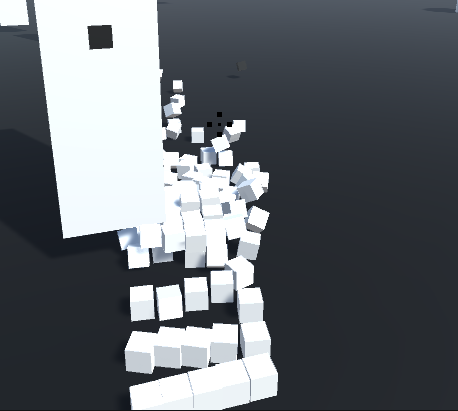

# Block Post 1 - Initial Draft

This is the first block post for the first iteration of the Game Design Document. It isn't a fully functioning game, but this part was meant to have the main mechanics.

## Mechanics

### Movement

The movement is quite simple in this game. You cant influence the characters location in any way, but you can influence the direction it is facing. There has been implemented code to restrict the character from doing 360 degrees orientation, mostly so later implementation of the game doesn't involve the player always having to check locations outside of view.

### Combat

The player can shoot with the scope in the middle. When hitting the enemy and killing it, as of right now there is a score. As off right now the score doesn't do anything, since I don't yet know if i want a money based or high-score based game.

### Enemies

The enemies are comprised of "pixels", or rather cubes. When hitting the enemy it breaks into smaller pieces, and if you hit the core of the enemy, it dies and explodes.

### Spawner

I have made an enemy spawner, which can spawn enemies within a duration.

### Whats next?

I want to finish up the mechanics I have introduced. Some of them has been lazily implemented, and i want to patch them up so I can have a easier time using them. I also want to fix up the UI a little. I have health implemented and a score. So i want to animate them and give them a bit more life.

### Link

Here is a link to the initial branch: https://github.com/Lemske/Pixel-Break/tree/InitialMechanics
