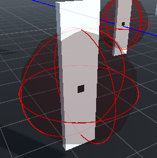
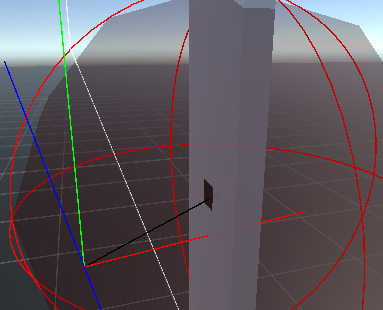

# Block Post 2 - Refinement Mechanics

### Clean up

Went though a lot of the code and refactored it. This was done for effeciency and readability.

### Extra Mechanic

So, I had to add some form of aim assist. The system this game is ported to, doesn't allow movement sensitivity. So I had to make a system that would help the player aim.

As I've done thoughout the project, I've tried out with my own solution instead of looking up a solution, there might be a simpler/better way, but i wanted to train my problem solving skills.

First we start with this aim assist sphere, which simply tells if your within the aim assist zone.

From here we checked which enemy is the closest and made a 2d slice of the route to the core of the enemy. This 2d slice is used to calculate the direction the aiming should assist in corresponding the movement of the player.

The aim assist also moves you a bit closer to the center of the enemy as you zoom. And zooming was also a mechanic I had to implement. I wanted the aim assist only to be active when zooming, so the assist felt as a player choice, and not a forced mechanic as they looked around for enemies.
