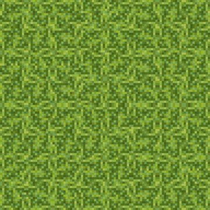
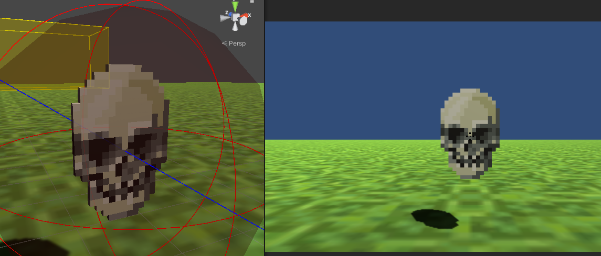

# Block Post 3 - Game Loop

### Game Loop

This is all about making something that can be played. There are a good couple of things i still need to to before I can call quits so lets go over them one by one.

### Main Menu

First a main Menu would be nice...

### Texturing the ground

I would have loved to do the texturing of the ground myself, in the pixel stile this game is going for. But I have to focus on more important things, so I simply used a stock texture from adobe stock (https://stock.adobe.com/dk/search?k=pixel+grass).
If I end up having time, I'll go back and make my own texture. But for now this will do, and id rather have texture than not.

### Enemies

Its time to go away from the simple test setup I've had until now. It has mainly been there to test how i wanted the cube physics to work. But now its time to make some real enemies.
I would like to have a couple, but we will see how far I'll come.
My first enemy is one that can move though the air and flies towards the player. Its inspired form stardew valley.
The reference pic comes again from adobe stock (https://stock.adobe.com/dk/images/pixel-skull-logo-vector-illustration-on-black-background-game-old-style-skull-illustration/238207113)
and this is what it looks like in the game:

