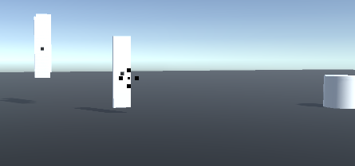

# Block Post 1 - Initial Draft

Welcome to the first block post for the game Pixel Break. This first block post will be about the initial draft of the game. The goal for this 'initial draft' is getting the main mechanics up and running. It's not really about making the code pretty, but more about getting the "pixel break" part of the game to work. This version might not be fully functional, it will serve as a fundament for the game.

## Mechanics

### Movement

The movement is quite simple in this game. You cant influence the characters location in any way, but you can influence the direction it is facing.
Now though trial, I didn't find it very enjoyable to have a 360 degree orientation on the character. So taking inspiration from the old stand still shooters, I restricted the vision to a general forward direction. I made it easy to change the restriction on the rotation, so that I can find the right balance though playing.

Shortly why I didn't like the 360 degree rotation. It isn't fun to look around all the time to find enemies, that might not even be there.

### Combat

The player can shoot using the scope centered on the screen. When hitting and killing an enemy, the player is awarded points. Currently, the score does not affect gameplay. Why? Because I have yet to decide whether the game will use a money-based or high-score based system.

I would like there to be a shop, but don't know if I'll have time for that. So the high-score system might be better for a kinda endless game, where its all about getting a high-score.

### Enemies

The enemies are comprised of "pixels", or rather cubes. When hitting the enemy it breaks into smaller pieces, and if you hit the core of the enemy, it dies and explodes.

This logic is handled by what i call Core Pixel(The black pixel in the picture below).

It has a matrix of all its children, and when an area is shoot at, it check the area of children, freeing them and sends them flying. If the core is hit, it dies and explodes.

### Spawner

I have made an enemy spawner, which can spawn enemies within a duration.

I found out gizmos are a thing, so I'm gonna keep using those as they are a great visual aid.

### Whats next?

I want to finish up the mechanics I have introduced. Some of them has been lazily implemented, and i want to patch them up so I can have a easier time using them. I also want to fix up the UI a little. I have health implemented and a score. So i want to animate them and give them a bit more life.

### Link

Here is a link to the initial branch: https://github.com/Lemske/Pixel-Break/tree/InitialMechanics
