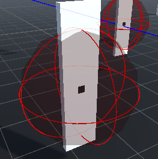
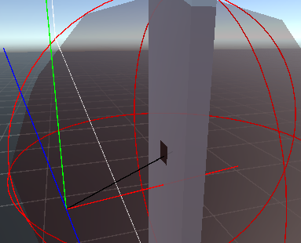

# Block Post 2 - Refinement Mechanics

### Clean up

"Went though a lot of the code and refactored it. This was done for effeciency and readability." - Lemske

This is what I would like to say i only did. I did it a little bit, but I found out out that the movement input on the machine the game is gonna be ported to doesn't support analog sensitivity. Therefor I introduced a new mechanic:

### Extra Mechanic

As stated before the system I'm porting this game to doesn't support analog sensitivity, as far as I'm told, which means the vertical and horizontal input is either 0 or (-)1. So to combat this I decided to make an aim assist tool.

As I've done thoughout the project, I've tried out with my own solution instead of looking up a solution, there might be a simpler/better way, but i wanted to train my problem solving skills.

First we start with this aim assist sphere, which simply tells if your within the aim assist zone.

From here we checked which enemy is the closest and make a 2d slice of the shortest route to the enemy core. This This distance is then used to correct the orientation direction towards the core. I'm not completely changing the orientation direction, simply helping it.

This mechanic is activated when you "zoom", which is a new mechanic introduced with this feature. Having it only trigger on zoom is done to make it feel like a player choice, and not a forced mechanic as they looked around for enemies.

Now, there is more to the aim assist tool.

I also included a mechanic where on zoom, the aim assist moves you a bit closer to the center of the enemy. Its quite hard to notice as one is playing... unless you spam the shit out of it...
The travel distance is calculated from the distance between the forward vector of the player and the center position of the enemy. It then helps one closer to the center the better the aim was when zoom was activated.

### Other Mechanic

I don't really remember but I'll give it a go.

Was told that the machine this is ported to only supports 8 direction, made it true on all systems, together with that no matter what you will get orientation inputs of 0 or (-)1.

I think it was in this phase where I refined some of the logic to the pixel breaking code. Where if you shoot the enemies on its side, it will do a clean slice though it. The calc was primarily done thought using the dot product of some face vectors.
