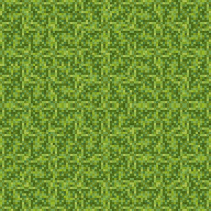
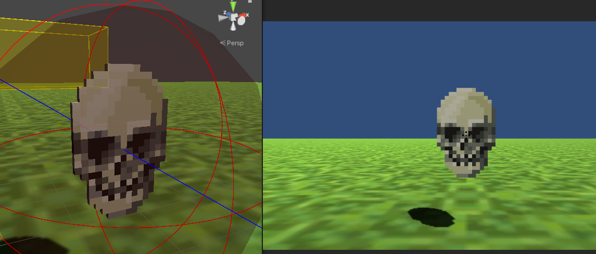

# Block Post 3 - Game Loop

### Game Loop

This is all about making something that can be played. There are a good couple of things i still need to to before I can call quits so lets go over them one by one.

### Main Menu

First a main Menu would be nice...

### Texturing the ground

I would have loved to do the texturing of the ground myself, in the pixel stile this game is going for. But I have to focus on more important things, so I simply used a stock texture from adobe stock (https://stock.adobe.com/dk/search?k=pixel+grass).
If I end up having time, I'll go back and make my own texture. But for now this will do, and id rather have texture than not.

### Enemies

Its time to go away from the simple test setup I've had until now. It has mainly been there to test how i wanted the cube physics to work. But now its time to make some real enemies.
I would like to have a couple, but we will see how far I'll come.
My first enemy is one that can move though the air and flies towards the player. Its inspired form stardew valley.
The reference pic comes again from adobe stock (https://stock.adobe.com/dk/images/pixel-skull-logo-vector-illustration-on-black-background-game-old-style-skull-illustration/238207113)
and this is what it looks like in the game:

### Enemy Movement

So, this was something I would have liked done in the Refinement phase, but better late then never. For this I've used a extremely quick state machine, that I would like people not to read please.

Since I really like some randomness in movement, so that its harder to find a pattern. I had to figure out how to make random movement, but control it to be within the bounds of view and level.

My solution, well first:

First I made these boundary boxes. Now there are two, cause I wanted to enemy to pick a random direction to walk in after a idle phase. <em> Idle phase: enemy turns to the side, harder to hit </em>. The boxes are mainly there to give a random point within their zone. And you kan also define a min heigh and max height, so that the enemy doesn't fly to high or low.

Step two:

I didn't want the enemies to go outside the players line of sight. So, I took these view limiters that are stated in the view (<em>They are the red lines</em>) and the octagonal vector that represents when something is within their boundaries. When the dot product of the enemy is < 0 it means that the enemy is outside the view. From here we correct its destination point to a place within the view. The code for this isn't how i really wanted it. As of right now it places the corrected point on a point withing the boundary view vector, but i would like it to take the closest point within the general view boundary.

Step three:

I simply don't want the enemy to go to close to the player. Using this sphere to make sure of that

So now I have gone though the general movement from spawning to the player. There is also some calc when doing attacks, so other than having a no no area on the player, there is also a oh yea one. When the enemy is within this sphere, it will attack the player. First it will move closer, be there a little bit and then attack. After that it will pick a random destination between the two spheres (<em>no no and oh yea</em>) and go there. If it falls outside the view, it will correct itself.

### Short description of the other things

- Made main menu and game over screen
- Added a health bar
- Decided it to be score based
- Added sound
- Fucked up on dynamic background music, there is short delay when starting new audio clip in unity, would like to fix.
- Added inputs for controller
