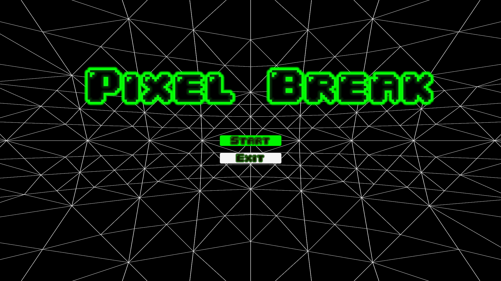
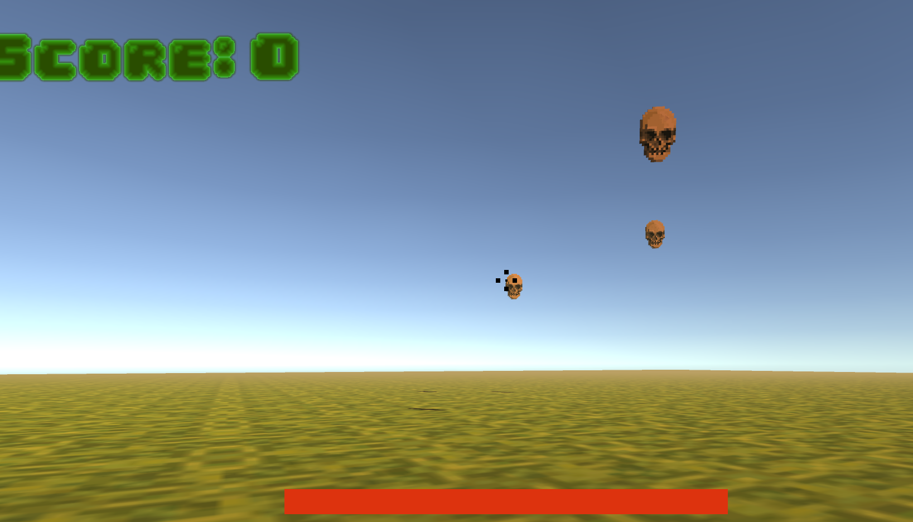
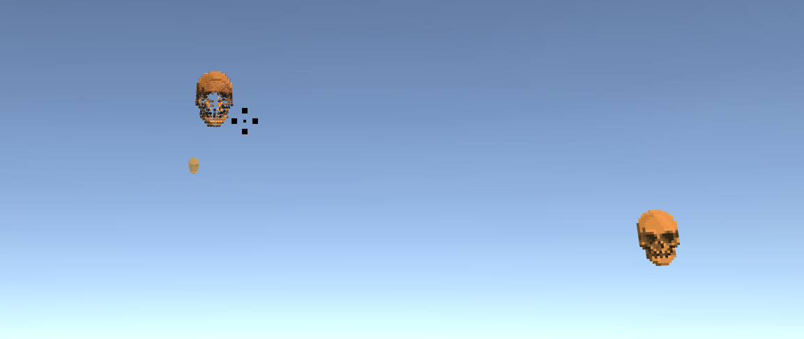
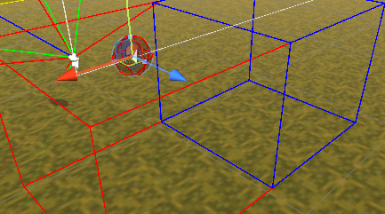
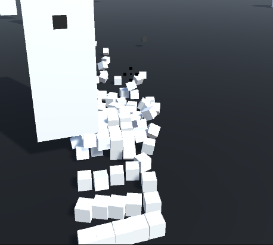
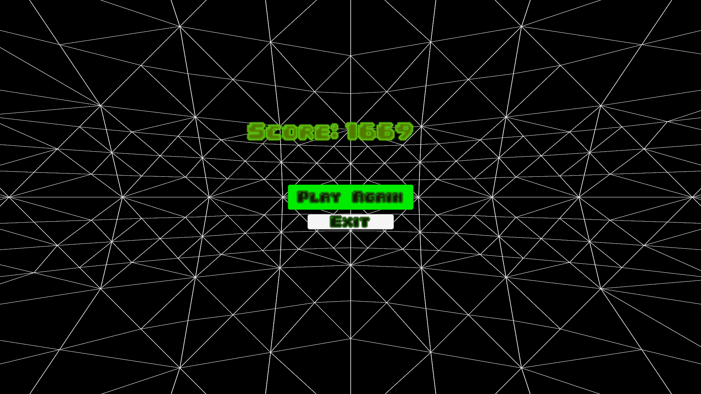

# Pixel Break

### What has changed since last?

1. Did some clean up concerning the pixel logic.
2. Tested this thing on the arcade machine, it worked, that was pretty nice cool and such UwU
3. Made the menus a bit color.
4. Tried playing around with the sky boxes in the game, giving it a bit more orange feel and also added fog.

5. Changed the Background sound system. Instead of giving them a order of clips for the engine to play, i instead give it timestamps to the music. Don't remember if i talked about it last blockpost, but created a DyNaMiC sOuNdSyStem! I split a song into some repeatable chunks so it could be played in any order, and make a smooth feel when you went from menu to game to gameover. This didn't work since replacing a audio file takes a little time, which made it lag. Sounded really annoying in a funny way, one can still hear it on the GameLoop branch.

### So what have I made?

Well I did make a stand still shooter with the breaking mechanic I wanted.

I made some enemy movement with some fun math involved. Calculating when an enemy is within bound, view and attack zone.

The pixel breaking mechanic, and how they would react to the orientation of the shot made by the player, was a fun little starting challenge.

I do think I wanted to make this game, primarily because of this mechanic.

But yea, there is a game loop, from main menu -> game play -> game over -> game play -> so on and so on. And maybe you want to quit in either the menu or game over screen. Hopefully not doing game play... didn't make that.

Final score?

You can aim, which will trigger an aim helper. This helper will help the player orientation towards the enemy as they move, and will also on zoom but the aim a little closer to the core.

### Gameplay summery

The objective is simple: shoot the enemies before they get too close. The enemies move and make sounds, and while I would have liked to add more effects, such as glowing eyes when they attack. But for now they move and make sound.

### Conclusion?

Well, I made a game! It has been fun to do, and I would have liked to work more on it since I've found it quite fun! It's pretty cool what you can do with something as simple as vectors. Found out how important a little planning was, and that doing a state machine without planning, can make something...

So yeah, here on the last day before hand-in, one could say that I should have made the state machine into easy reusable components. I did start on it, but then my motivation faded, as I only found it cool if I had time for more enemies. If I had planned the design a little before just diving in, I probably could have made one more pixel art piece and added some movement to it with the pathing tools I'd built. So yeah, planning just a little can be smart.
